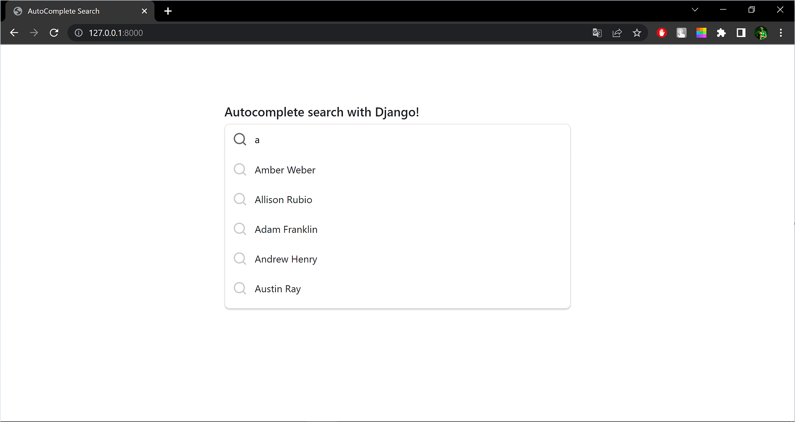

# Auto-search-with-django
Imagine creating a fully functional auto-search app using Django, similar to the convenient search feature seen on popular websites. By incorporating this functionality, we can offer users a clean and intuitive interface, greatly simplifying their search experience. So, let's embark on the journey of building this remarkable auto-search app with Django!

### Run Activate the virtual environment:
    env/Scripts/activate

### Run server Django in virtual environment :
    py manage.py runserver

